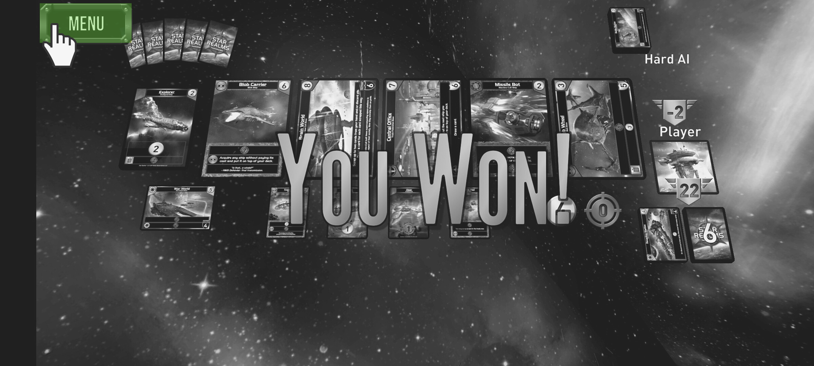
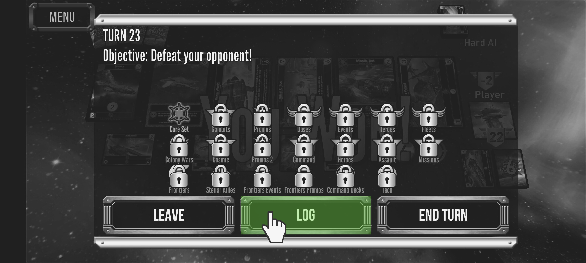
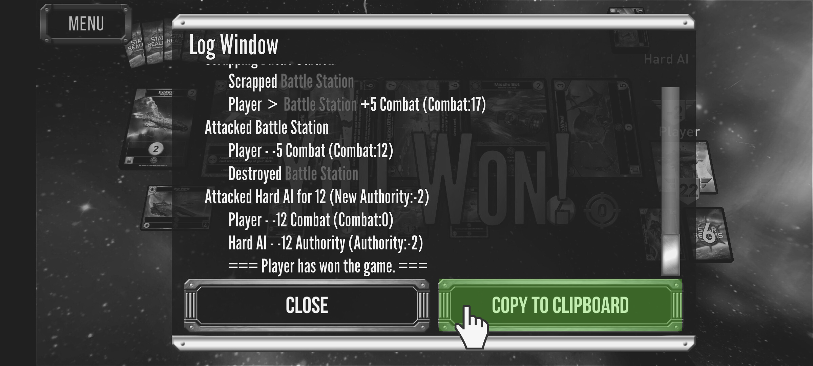

# Star Realms battle log parser

## Prerequisite

Node.js needs to be installed in order to run the website built with Next.js

Antlr4 jar file needs to be available in order to generated the lexer/parser from the library
See the getting started guide [here](https://github.com/antlr/antlr4/blob/master/doc/getting-started.md)

## Work on the grammar

This repo contains a grammar written in Antlr4 for the Star Realms Battle log file.

Any language  can be used while testing the grammar in isolation

The `test_grammar.bat` file will generate a lexer/parser in Java from the grammar file
and use `logfile` as input to generate a parse tree

## Generate the antlr4 code used by the website

```bash
antlr4 -Dlanguage=JavaScript StarRealms.g4 -visitor -o website/lib/antlr4
```

Any changes in the grammar will mean the visitor file (`website/lib/visitor.js`) will need to be updated

## Run the website

```bash
cd website
npm run dev
```

## Testing

You can run the test suite using the following commands:

1. start the website:
```bash
cd website
npm run dev
```
2. In a separate window run:
```bash
antlr4 -Dlanguage=JavaScript StarRealms.g4 -visitor -o website/test/antlr4
cd website/test
node test.js
```

The test suite will check 3 things:
1. That the grammar can successfully be used to parse all the test cases (no parsing errors).
2. That that generated parse tree is the same as previous iterations of the app. This ensures we are not introducing errors (no tree generation errors)
3. That the json object representing a battle is the same as previous iterations of the app. This ensures we are not introducing errors (no battle object errors)

Some changes to the tree structure can be expected when the grammar changes. In that case the test cases need to be updated with the latest data
Changes to the battle object should be less frequent.


## Add battle log to the input field

Once you finished a game of Star Realms on desktop or mobile you can retrieve the battle logs and
use it as input to the parser. The following screenshots shows how to get the battle logs.





